```plantuml
@startuml
scale 1.5
left to right direction
skinparam linetype ortho

' Макросы для DDD
!define BOUNDED_CONTEXT(name) rectangle name <<Ограниченный контекст>>
!define AGGREGATE(name) rectangle name <<Агрегат>>

skinparam <<Ограниченный контекст>> {
    roundcorner 80
    BackgroundColor #F0F8FF
}

skinparam <<Агрегат>> {
    BackgroundColor #FFF8DC
}

' =======================
' Catalog Context
' =======================

BOUNDED_CONTEXT("Catalog_Context") as CatalogContext {

    AGGREGATE("Каталог_фонда") as CatalogAgg {

        abstract class LibraryComponent {
            - id : int
            - name : string
            + Add(component : LibraryComponent)
            + Remove(component : LibraryComponent)
            + GetChild(id:int) : LibraryComponent
            + Operation() : void
        }

        class Catalog <<Корень агрегата>> {
            - shelves : List<LibraryComponent>
            + Add(component : LibraryComponent)
            + Remove(component : LibraryComponent)
            + GetChild(id:int) : LibraryComponent
            + Operation() : void
        }

        class Shelf <<Сущность>> {
            - cells : List<LibraryComponent>
            + Operation() : void
        }

        class Cell <<Сущность>> {
            - book : Book
            + Operation() : void
        }

        class Book <<Сущность>> {
            - author : string
            - isAvailable : bool
            + MarkAsBorrowed()
            + MarkAsReturned()
            + Operation() : void
        }

        LibraryComponent <|-- Catalog
        LibraryComponent <|-- Shelf
        LibraryComponent <|-- Cell
        LibraryComponent <|-- Book

        Catalog *-- Shelf
        Shelf *-- Cell
        Cell o-- Book
    }

    class IBookRepository <<Repository>> {
        + GetAllBooks() : IEnumerable<Book>
        + GetBookById(id:int) : Book
        + AddBook(book:Book)
        + UpdateBook(book:Book)
        + RemoveBook(book:Book)
    }

    class InMemoryBookRepository <<Singleton>> {
        - books : List<Book>
        {static} + Instance : InMemoryBookRepository
    }

    IBookRepository <|.. InMemoryBookRepository
    InMemoryBookRepository o-- Book
}

' =======================
' Readers Context
' =======================

BOUNDED_CONTEXT("Readers_Context") as ReadersContext {

    AGGREGATE("Читатель_и_выдачи") as ReaderAgg {

        class Reader <<Корень агрегата>> {
            - id : int
            - name : string
        }

        class Loan <<Сущность>> {
            - bookId : int
            - readerId : int
            - borrowedAt : DateTime
            - returnedAt : DateTime?
            + MarkAsReturned()
            + IsActive : bool
        }

        Reader o-- Loan
    }

    class IReaderRepository <<Repository>> {
        + GetAllReaders() : IEnumerable<Reader>
        + GetReaderById(id:int) : Reader
        + AddReader(reader:Reader)
    }

    class InMemoryReaderRepository <<Singleton>> {
        - readers : List<Reader>
        {static} + Instance : InMemoryReaderRepository
    }

    class ILoanRepository <<Repository>> {
        + AddLoan(loan:Loan)
        + GetActiveLoanByBookId(bookId:int) : Loan
        + UpdateLoan(loan:Loan)
    }

    class InMemoryLoanRepository <<Singleton>> {
        - loans : List<Loan>
        {static} + Instance : InMemoryLoanRepository
    }

    IReaderRepository <|.. InMemoryReaderRepository
    ILoanRepository <|.. InMemoryLoanRepository

    InMemoryReaderRepository o-- Reader
    InMemoryLoanRepository o-- Loan
}

' Связь агрегатов: заем ссылается на книгу в каталоге
ReadersContext::Loan ..> CatalogContext::Book : ссылается на

' =======================
' Application / Facade
' =======================

package Application {
    class Library <<Facade>> {
        - bookRepo : IBookRepository
        - readerRepo : IReaderRepository
        - loanRepo : ILoanRepository
        + Catalog : Catalog
        + AddShelf(id:int, name:string)
        + AddCellToShelf(shelfId:int, cellId:int, name:string)
        + AddBookToCell(cellId:int, title:string, author:string)
        + AddReader(id:int, name:string)
        + IssueBook(bookId:int, readerId:int)
        + ReturnBook(bookId:int)
        + WriteOffBook(bookId:int)
        + PrintCatalog()
        + PrintReaders()
        + PrintCatalogStructure()
        + PrintBooksWithLocation()
    }

    Library ..> IBookRepository
    Library ..> IReaderRepository
    Library ..> ILoanRepository
    Library o-- Catalog
}

package Data {
    class TestDataSeeder {
        + Seed(library:Library)
    }

    TestDataSeeder ..> Library
}

@enduml
```

# Диаграмма классов — Информационная система библиотеки

### **1. Catalog Context** (Контекст каталога)
#### **Domain.Components** (Доменные компоненты)
- **`LibraryComponent`** (абстрактный класс)
  - `-id: int` — идентификатор
  - `-name: string` — название
  - `+Add(component: LibraryComponent)` — добавить компонент
  - `+Remove(component: LibraryComponent)` — удалить компонент
  - `+GetChild(id: int): LibraryComponent` — получить дочерний компонент
  - `+Operation(): void` — выполнить операцию

- **`Catalog`** (наследует `LibraryComponent`)
  - `-shelves: List<LibraryComponent>` — список стеллажей

- **`Shelf`** (наследует `LibraryComponent`)
  - `-cells: List<LibraryComponent>` — список ячеек

- **`Cell`** (наследует `LibraryComponent`)
  - `-book: Book` — книга в ячейке

- **`Book`** (наследует `LibraryComponent`)
  - `-author: string` — автор книги
  - `-isAvailable: bool` — доступна ли книга
  - `+MarkAsBorrowed()` — пометить как выданную
  - `+MarkAsReturned()` — пометить как возвращенную

#### **Repository** (Хранилище)
- **`IBookRepository`** (интерфейс)
  - `+GetAllBooks(): IEnumerable<Book>` — получить все книги
  - `+GetBookById(id: int): Book` — получить книгу по ID
  - `+AddBook(book: Book)` — добавить книгу
  - `+UpdateBook(book: Book)` — обновить книгу
  - `+RemoveBook(book: Book)` — удалить книгу

- **`InMemoryBookRepository`** (класс) <<singleton, repository>>
  - `-books: List<Book>` — список книг в памяти
  - `{static} +Instance: InMemoryBookRepository` — единственный экземпляр
  - Реализует `IBookRepository`
  - Композиция с `Book` (ромбик)

---

### **2. Readers Context** (Контекст читателей)
#### **Domain.Readers** (Доменные объекты читателей)
- **`Reader`** (класс)
  - `-id: int` — идентификатор читателя
  - `-name: string` — имя читателя

- **`Loan`** (класс)
  - `-bookId: int` — ID выданной книги
  - `-readerId: int` — ID читателя
  - `-borrowedAt: DateTime` — дата выдачи
  - `-returnedAt: DateTime?` — дата возврата
  - `+MarkAsReturned()` — пометить как возвращенную
  - `+IsActive: bool` — активна ли выдача
  - Использует `Book` и `Reader` (пунктирная стрелка)

#### **Repository** (Хранилище)
- **`IReaderRepository`** (интерфейс)
  - `+GetAllReaders(): IEnumerable<Reader>` — все читатели
  - `+GetReaderById(id: int): Reader` — читатель по ID
  - `+AddReader(reader: Reader)` — добавить читателя

- **`InMemoryReaderRepository`** (класс) <<singleton, repository>>
  - `-readers: List<Reader>` — список читателей
  - `{static} +Instance: InMemoryReaderRepository` — единственный экземпляр
  - Реализует `IReaderRepository`
  - Композиция с `Reader`

- **`ILoanRepository`** (интерфейс)
  - `+AddLoan(loan: Loan)` — добавить выдачу
  - `+GetActiveLoanByBookId(bookId: int): Loan` — активная выдача по ID книги
  - `+UpdateLoan(loan: Loan)` — обновить выдачу

- **`InMemoryLoanRepository`** (класс) <<singleton, repository>>
  - `-loans: List<Loan>` — список выдач
  - `{static} +Instance: InMemoryLoanRepository` — единственный экземпляр
  - Реализует `ILoanRepository`
  - Композиция с `Loan`

---

### **3. Application** (Приложение)
- **`Library`** (класс) <<facade>>
  - `-bookRepo: IBookRepository` — репозиторий книг
  - `-readerRepo: IReaderRepository` — репозиторий читателей
  - `-loanRepo: ILoanRepository` — репозиторий выдач
  - `+Catalog: Catalog` — корневой каталог

  - **Основные методы:**
    - `+AddShelf(id: int, name: string)` — добавить стеллаж
    - `+AddCellToShelf(shelfId: int, cellId: int, name: string)` — добавить ячейку
    - `+AddBookToCell(cellId: int, title: string, author: string)` — добавить книгу
    - `+AddReader(id: int, name: string)` — добавить читателя
    - `+IssueBook(bookId: int, readerId: int)` — выдать книгу
    - `+ReturnBook(bookId: int)` — вернуть книгу
    - `+WriteOffBook(bookId: int)` — списать книгу
    - `+PrintCatalog()` — печать каталога
    - `+PrintReaders()` — печать читателей
    - `+PrintCatalogStructure()` — печать структуры
    - `+PrintBooksWithLocation()` — печать книг с расположением

  - **Связи:**
    - Композиция с `Catalog` (ромбик)
    - Зависимости от `IBookRepository`, `IReaderRepository`, `ILoanRepository` (пунктирные стрелки)

---

### **4. Data** (Данные)
- **`TestDataSeeder`** (класс)
  - `+Seed(library: Library)` — заполнить библиотеку тестовыми данными
