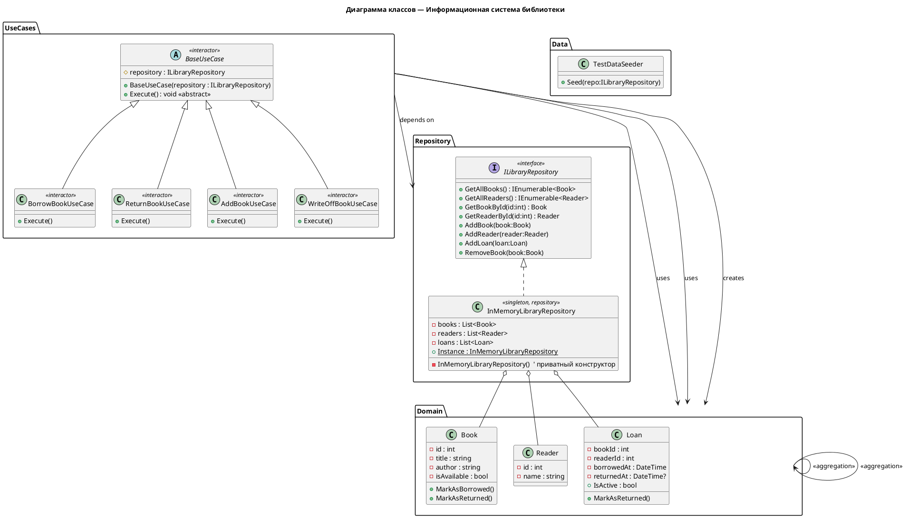

```plantuml
@startuml
title Диаграмма классов — Информационная система библиотеки

package Domain {
    class Book {
        - id : int
        - title : string
        - author : string
        - isAvailable : bool
        + MarkAsBorrowed()
        + MarkAsReturned()
    }

    class Reader {
        - id : int
        - name : string
    }

    class Loan {
        - bookId : int
        - readerId : int
        - borrowedAt : DateTime
        - returnedAt : DateTime?
        + MarkAsReturned()
        + IsActive : bool
    }
}

Domain::Loan --> Domain::Book : <<aggregation>>
Domain::Loan --> Domain::Reader : <<aggregation>>

package Repository {
    interface ILibraryRepository <<interface>> {
        + GetAllBooks() : IEnumerable<Book>
        + GetAllReaders() : IEnumerable<Reader>
        + GetBookById(id:int) : Book
        + GetReaderById(id:int) : Reader
        + AddBook(book:Book)
        + AddReader(reader:Reader)
        + AddLoan(loan:Loan)
        + RemoveBook(book:Book)
    }

    class InMemoryLibraryRepository <<singleton, repository>> {
        - books : List<Book>
        - readers : List<Reader>
        - loans : List<Loan>
        - InMemoryLibraryRepository()  ' приватный конструктор
        {static} + Instance : InMemoryLibraryRepository
    }

    ILibraryRepository <|.. InMemoryLibraryRepository
    InMemoryLibraryRepository o-- Book
    InMemoryLibraryRepository o-- Reader
    InMemoryLibraryRepository o-- Loan
}

package UseCases {

    abstract class BaseUseCase <<interactor>> {
        # repository : ILibraryRepository
        + BaseUseCase(repository : ILibraryRepository)
        + Execute() : void <<abstract>>
    }

    class BorrowBookUseCase <<interactor>> {
        + Execute()
    }

    class ReturnBookUseCase <<interactor>> {
        + Execute()
    }

    class AddBookUseCase <<interactor>> {
        + Execute()
    }

    class WriteOffBookUseCase <<interactor>> {
        + Execute()
    }

    BaseUseCase <|-- BorrowBookUseCase
    BaseUseCase <|-- ReturnBookUseCase
    BaseUseCase <|-- AddBookUseCase
    BaseUseCase <|-- WriteOffBookUseCase
}

package Data {
    class TestDataSeeder {
        + Seed(repo:ILibraryRepository)
    }
}

UseCases::BorrowBookUseCase --> Domain::Book : uses
UseCases::BorrowBookUseCase --> Domain::Reader : uses
UseCases::BorrowBookUseCase --> Domain::Loan : creates
UseCases::BorrowBookUseCase --> Repository::ILibraryRepository : depends on

@enduml
```

