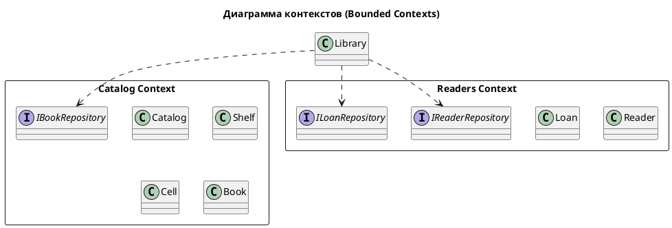

```plantuml
@startuml
title Диаграмма контекстов (Bounded Contexts)

skinparam packageStyle rect

rectangle "Catalog Context" {
  class Catalog
  class Shelf
  class Cell
  class Book
  interface IBookRepository
}

rectangle "Readers Context" {
  class Reader
  class Loan
  interface IReaderRepository
  interface ILoanRepository
}

class Library

Library ..> IBookRepository
Library ..> IReaderRepository
Library ..> ILoanRepository

@enduml
```

