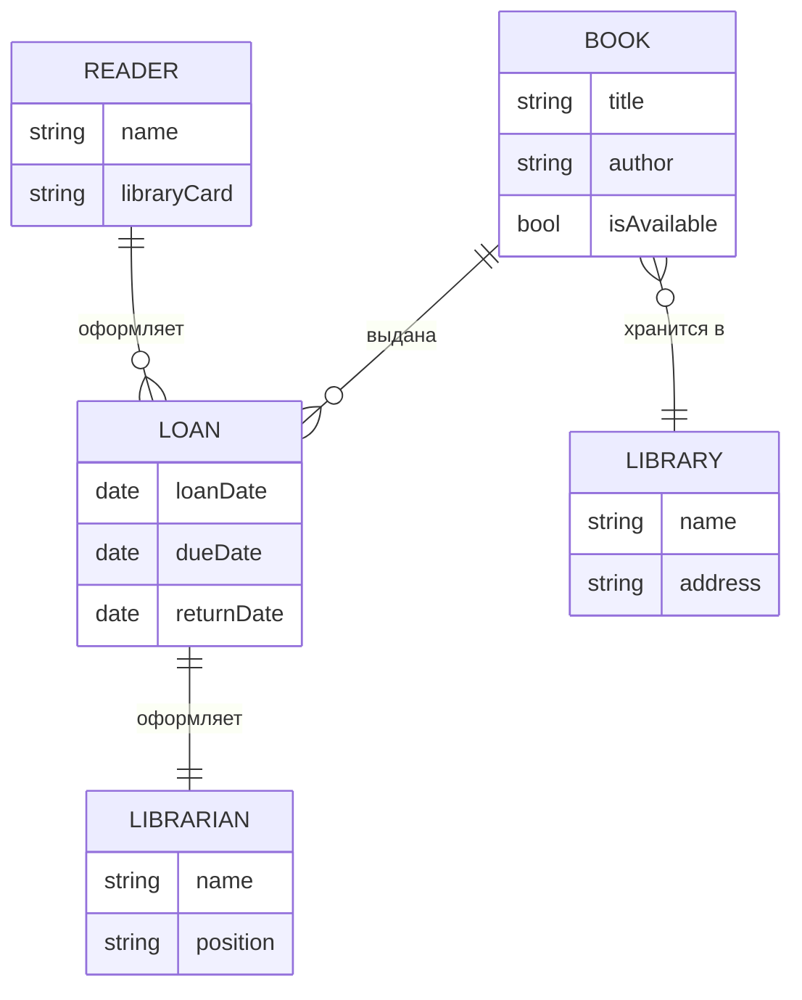

# Модель предметной области

## Описание сущностей:
- **Книга (Book)** — основной объект учёта в библиотеке
- **Читатель (Reader)** — зарегистрированный пользователь библиотеки  
- **Выдача (Loan)** — факт передачи книги читателю на определенный срок
- **Библиотека (Library)** — организация, хранящая книжный фонд
- **Библиотекарь (Librarian)** — сотрудник, осуществляющий выдачу и прием книг
