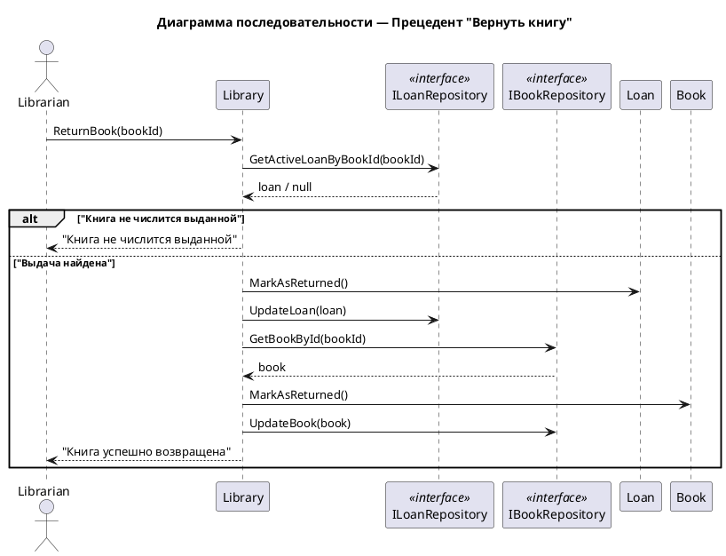

# Сценарий возврата книги

## Начало операции

1. Библиотекарь выбирает операцию "Вернуть книгу" в системе.
2. Система запрашивает идентификатор возвращаемой книги.

## Идентификация книги

3. Библиотекарь вводит номер книги (сканирует штрих-код или вводит вручную).
4. Система ищет активную выдачу для этой книги.

## Проверка наличия выдачи

5. Если книга не найдена в базе или не числится выданной:
   - Система показывает сообщение: "Книга не числится выданной".
   - Сценарий завершается.

6. Если активная выдача найдена:
   - Система переходит к следующему шагу.

## Обновление записи о выдаче (LOAN)

7. Система помечает запись о выдаче как возвращенную:
   - Устанавливает фактическую дату возврата (returnDate = текущая дата).
   - Изменяет статус выдачи на "завершена".

## Обновление статуса книги (BOOK)

8. Система изменяет статус книги:
   - Устанавливает флаг isAvailable = true (книга доступна для выдачи).
   - Сохраняет изменения в каталоге книг.

## Завершение операции

9. Система показывает сообщение: "Книга успешно возвращена".
10. Операция завершена.

