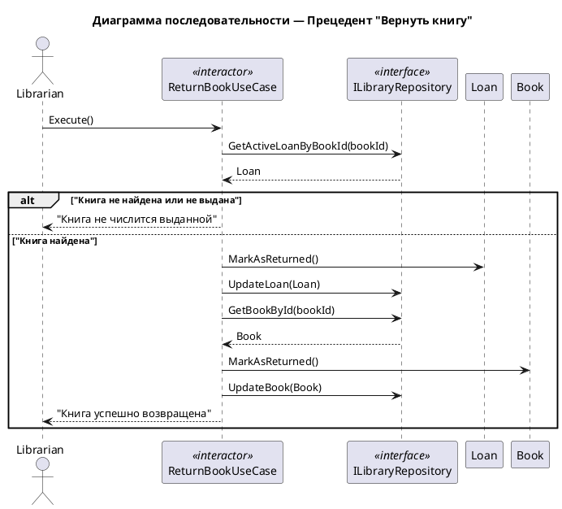

```plantuml
@startuml
title Диаграмма последовательности — Прецедент "Вернуть книгу"

actor Librarian
participant "ReturnBookUseCase" as UseCase <<interactor>>
participant "ILibraryRepository" as Repo <<interface>>
participant "Loan"
participant "Book"

Librarian -> UseCase : Execute()
UseCase -> Repo : GetActiveLoanByBookId(bookId)
Repo --> UseCase : Loan

alt "Книга не найдена или не выдана"
    UseCase --> Librarian : "Книга не числится выданной"
else "Книга найдена"
    UseCase -> Loan : MarkAsReturned()
    UseCase -> Repo : UpdateLoan(Loan)

    UseCase -> Repo : GetBookById(bookId)
    Repo --> UseCase : Book
    UseCase -> Book : MarkAsReturned()
    UseCase -> Repo : UpdateBook(Book)

    UseCase --> Librarian : "Книга успешно возвращена"
end
@enduml
```

