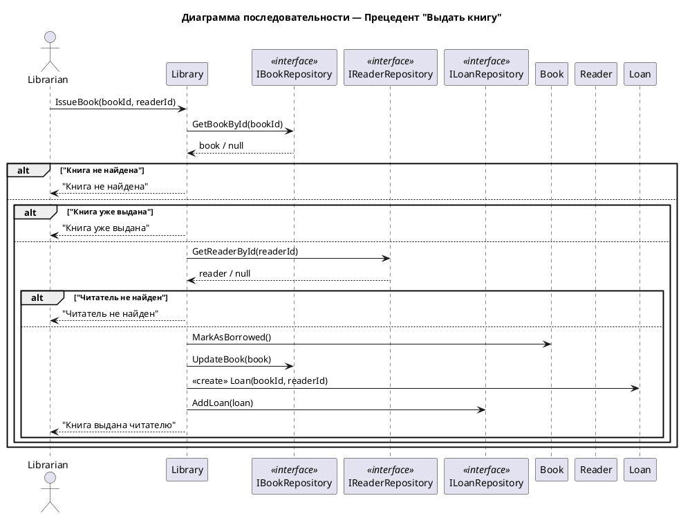

# Сценарий выдачи книги

## Начало операции
1. Библиотекарь выбирает операцию **"Выдать книгу"** в системе.
2. Система запрашивает идентификатор книги.
3. Система запрашивает идентификатор читателя.
4. Библиотекарь вводит оба идентификатора.

## Поиск книги
5. Система ищет книгу по идентификатору.

## Проверка книги
6. **Если книга не найдена:**
   - Система показывает сообщение: **"Книга не найдена"**.
   - Сценарий завершается.

7. **Если книга найдена:**
   - Система **предполагает, что книга доступна** (проверка доступности неявная).
   - Переходит к поиску читателя.

## Поиск читателя
8. Система ищет читателя по идентификатору.

## Проверка читателя
9. **Если читатель не найден:**
   - Система показывает сообщение: **"Читатель не найден"**.
   - Сценарий завершается.

## Выдача книги
10. **Если книга и читатель найдены:**
    - Система **помечает книгу как выданную** (предполагается, что она доступна).
    - Система **обновляет статус книги** в репозитории.
    - Система **создает новую запись о выдаче**.
    - Система **сохраняет запись о выдаче** в репозитории.

## Завершение операции
11. Система показывает сообщение: **"Книга выдана читателю"**.
12. Операция завершена.

