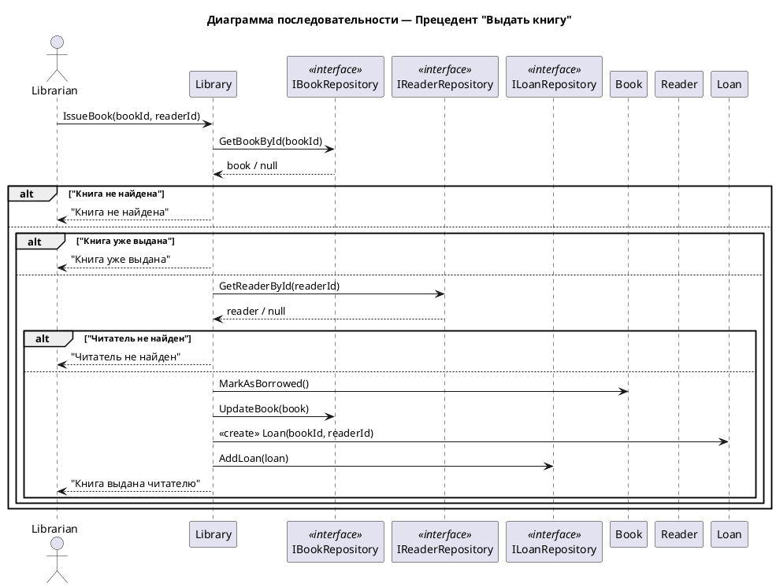

# Сценарий выдачи книги

## Начало операции

1. Библиотекарь выбирает операцию "Выдать книгу" в системе.
2. Система запрашивает идентификатор книги.
3. Система запрашивает идентификатор читателя.

## Поиск книги

4. Библиотекарь вводит номер книги (сканирует штрих-код или вводит вручную).
5. Система ищет книгу по идентификатору.

## Поиск читателя

6. Библиотекарь вводит номер читательского билета.
7. Система ищет читателя по идентификатору.

## Проверка доступности книги

8. Если книга не найдена:
   - Система показывает сообщение: "Книга не найдена".
   - Сценарий завершается.

9. Если книга найдена, но не доступна для выдачи:
   - Система показывает сообщение: "Книга уже выдана".
   - Сценарий завершается.

## Проверка читателя

10. Если читатель не найден:
    - Система показывает сообщение: "Читатель не найден".
    - Сценарий завершается.

## Обновление статуса книги

11. Если все проверки пройдены:
    - Система помечает книгу как выданную (устанавливает isAvailable = false).

## Создание записи о выдаче

12. Система создает новую запись о выдаче (LOAN):
    - Устанавливает дату выдачи (loanDate = текущая дата).
    - Устанавливает срок возврата (dueDate = loanDate + период выдачи).
    - Связывает запись с книгой и читателем.

## Завершение операции

13. Система показывает сообщение: "Книга выдана читателю".
14. Операция завершена.

