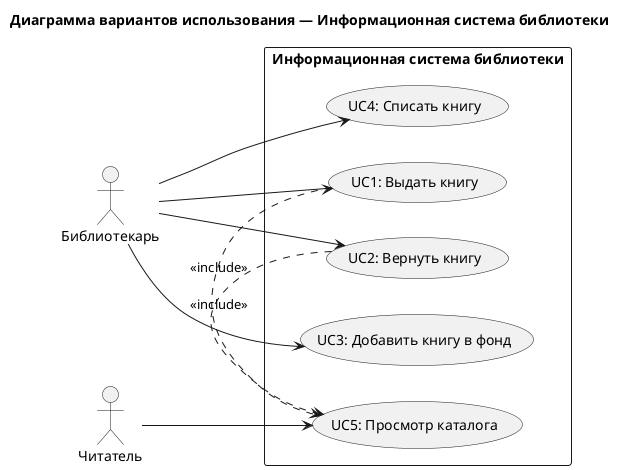
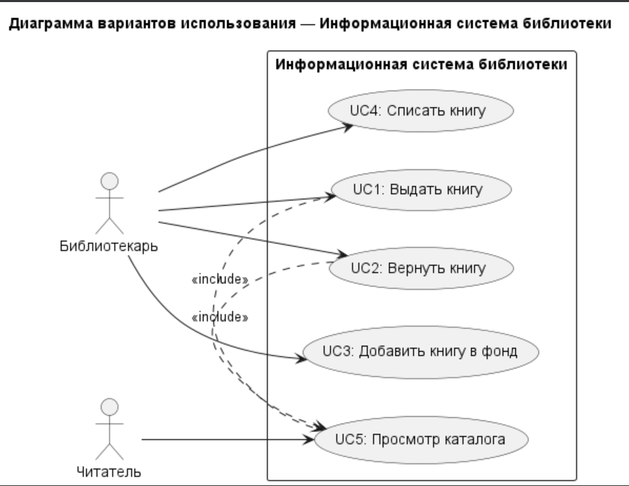

```plantuml
@startuml
skinparam packageStyle rect
left to right direction


title Диаграмма вариантов использования — Информационная система библиотеки

actor "Библиотекарь" as Librarian
actor "Читатель" as Reader

rectangle "Информационная система библиотеки" as System {
usecase "UC1: Выдать книгу" as UC_Borrow
usecase "UC2: Вернуть книгу" as UC_Return
usecase "UC3: Добавить книгу в фонд" as UC_Add
usecase "UC4: Списать книгу" as UC_WriteOff
usecase "UC5: Просмотр каталога" as UC_View
}

Librarian --> UC_Borrow
Librarian --> UC_Return
Librarian --> UC_Add
Librarian --> UC_WriteOff
Reader --> UC_View

UC_Borrow .> UC_View : <<include>>
UC_Return .> UC_View : <<include>>

@enduml
```

