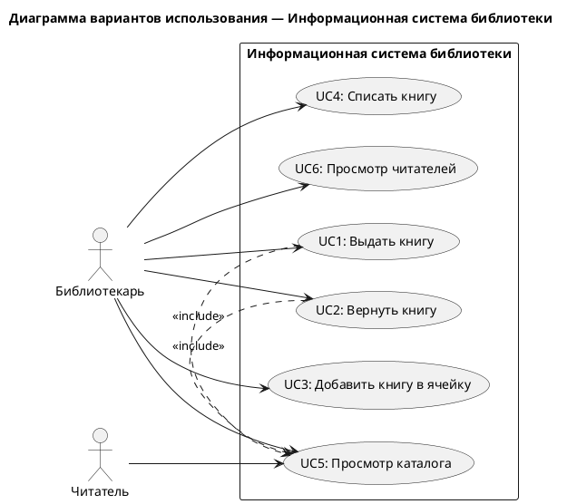

```plantuml
@startuml
skinparam packageStyle rect
left to right direction

title Диаграмма вариантов использования — Информационная система библиотеки

actor "Библиотекарь" as Librarian
actor "Читатель" as Reader

rectangle "Информационная система библиотеки" as System {
  usecase "UC1: Выдать книгу" as UC_Borrow
  usecase "UC2: Вернуть книгу" as UC_Return
  usecase "UC3: Добавить книгу в ячейку" as UC_Add
  usecase "UC4: Списать книгу" as UC_WriteOff
  usecase "UC5: Просмотр каталога" as UC_View
  usecase "UC6: Просмотр читателей" as UC_ViewReaders
}

Librarian --> UC_Borrow
Librarian --> UC_Return
Librarian --> UC_Add
Librarian --> UC_WriteOff
Librarian --> UC_View
Librarian --> UC_ViewReaders

Reader --> UC_View

UC_Borrow .> UC_View : <<include>>
UC_Return .> UC_View : <<include>>

@enduml
```

