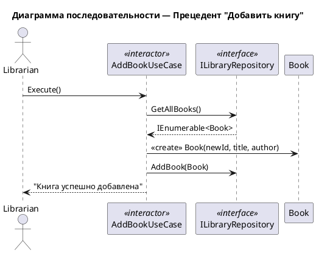

```plantuml
@startuml
title Диаграмма последовательности — Прецедент "Добавить книгу"

actor Librarian
participant "AddBookUseCase" as UseCase <<interactor>>
participant "ILibraryRepository" as Repo <<interface>>
participant "Book"

Librarian -> UseCase : Execute()
UseCase -> Repo : GetAllBooks()
Repo --> UseCase : IEnumerable<Book>

UseCase -> Book : <<create>> Book(newId, title, author)
UseCase -> Repo : AddBook(Book)
UseCase --> Librarian : "Книга успешно добавлена"
@enduml
```

