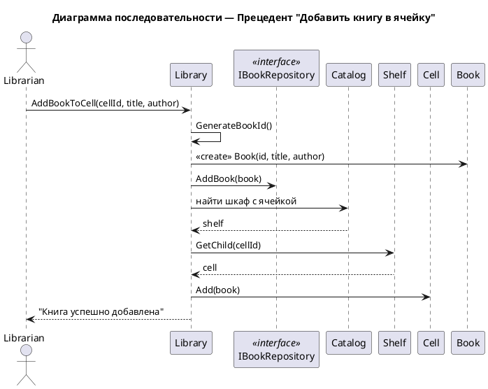

# Сценарий добавления книги

## Начало операции

1. Библиотекарь выбирает операцию "Добавить книгу" в системе.
2. Система отображает форму для ввода данных о новой книге.

## Ввод данных о книге

3. Библиотекарь вводит данные книги:
   - Название книги
   - Автора книги
   - Дополнительные данные (при необходимости)

4. Система генерирует уникальный идентификатор для книги.

## Проверка существования книги

5. Система проверяет все существующие книги в каталоге.
6. Система проверяет, нет ли уже книги с такими же данными.

## Создание новой книги

7. Если книга с такими данными уже существует:
   - Система показывает сообщение: "Такая книга уже есть в каталоге".
   - Сценарий завершается.

8. Если книги с такими данными нет:
   - Система создает новую запись о книге:
     - Присваивает уникальный идентификатор
     - Устанавливает статус "доступна" (isAvailable = true)
     - Заполняет все введенные данные

## Сохранение книги

9. Система добавляет новую книгу в каталог.
10. Система сохраняет все изменения.

## Завершение операции

11. Система показывает сообщение: "Книга успешно добавлена".
12. Операция завершена.

