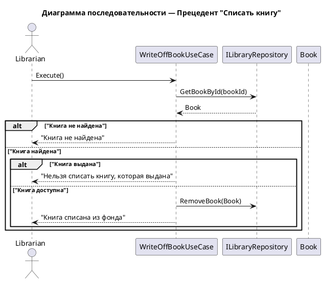

```plantuml
@startuml
title Диаграмма последовательности — Прецедент "Списать книгу"

actor Librarian
participant "WriteOffBookUseCase" as UseCase
participant "ILibraryRepository" as Repo
participant "Book"

Librarian -> UseCase : Execute()
UseCase -> Repo : GetBookById(bookId)
Repo --> UseCase : Book

alt "Книга не найдена"
    UseCase --> Librarian : "Книга не найдена"
else "Книга найдена"
    alt "Книга выдана"
        UseCase --> Librarian : "Нельзя списать книгу, которая выдана"
    else "Книга доступна"
        UseCase -> Repo : RemoveBook(Book)
        UseCase --> Librarian : "Книга списана из фонда"
    end
end
@enduml
```
