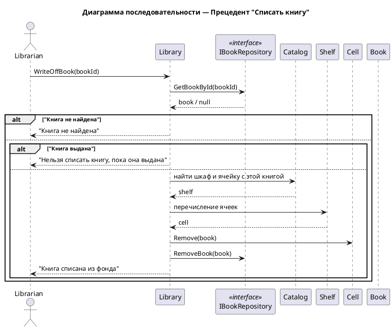

# Сценарий списания книги

## Начало операции
1. Библиотекарь выбирает операцию "Списать книгу" в системе.
2. Система запрашивает идентификатор книги.

## Поиск книги
3. Библиотекарь вводит номер книги.
4. Система ищет книгу в репозитории.

## Проверка существования книги
5. **Если книга не найдена:**
   - Сообщение: "Книга не найдена".
   - Сценарий завершается.

## Проверка статуса книги
6. **Если книга найдена:**
   - Система проверяет: `isAvailable == false`?
   
7. **Если книга выдана (недоступна):**
   - Сообщение: "Нельзя списать книгу, пока она выдана".
   - Сценарий завершается.

## Удаление книги из структуры библиотеки
8. **Если книга доступна:**
   - Система **находит ячейку с книгой** через каталог:
     - Ищет в каталоге нужный стеллаж
     - В стеллаже находит ячейку с этой книгой
   - **Удаляет книгу из ячейки** (`cell.Remove(book)`)

## Удаление книги из репозитория
9. Система **удаляет книгу** из репозитория книг (`RemoveBook(book)`).

## Завершение операции
10. Сообщение: "Книга списана из фонда".
11. Операция завершена.
    

